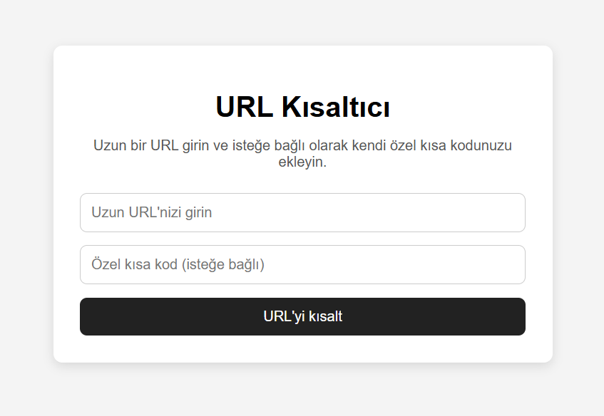

# URL Shortener

A simple URL shortener backend project built with Node.js, Express, and SQLite.

## 🌐 Live Demo
https://url-shortener-d4hm.onrender.com/

## 📸 Screenshot


## Features

* Create short URLs from long URLs
* Store URLs in SQLite database
* Redirect short URLs to original URLs
* Click count tracking
* Stats endpoint for shortened URLs
* URL validation before shortening
* REST API structure with routes and controllers
* Custom short code support
* Simple frontend interface with HTML, CSS, and JavaScript

## Technologies

* Node.js
* Express.js
* SQLite3

## Project Structure

```bash
src/
  app.js
  db.js
  controllers/
    urlController.js
  routes/
    urlRoutes.js
public/
  index.html
  style.css
  script.js
database.sqlite
package.json
README.md
```

## Installation

```bash
npm install
npm run dev
```

Server runs at:

```
http://localhost:3000
```

## API Endpoints

### Create Short URL

```http
POST /shorten
```

Request body:

```json
{
  "originalUrl": "https://www.google.com",
  "customCode": "mygoogle"
}
```

Response:

```json
{
  "message": "Short URL created successfully",
  "originalUrl": "https://www.google.com",
  "shortCode": "abc123",
  "shortUrl": "http://localhost:3000/abc123"
}
```

---

### Redirect to Original URL

```http
GET /:code
```

Example:

```
http://localhost:3000/abc123
```

This will redirect to the original URL.

---

### Get URL Stats

```http
GET /stats/:code
```

Response:

```json
{
  "originalUrl": "https://www.google.com",
  "shortCode": "abc123",
  "shortUrl": "http://localhost:3000/abc123",
  "clickCount": 3,
  "createdAt": "2026-04-23 16:24:33"
}
```

---

## Validation Rules

* URL must be a valid format
* URL must start with `http://` or `https://`
* `customCode` can only contain letters, numbers, hyphen (`-`) and underscore (`_`)
* duplicate custom codes are not allowed
---

## Future Improvements

* Custom short codes
* Expiration date for URLs
* Frontend UI (React)
* Authentication system
* Deployment (Render / Railway)

## Deployment Note

This project can be deployed on Render.  
When using SQLite on Render without a persistent disk, database data may reset after redeploys or restarts.